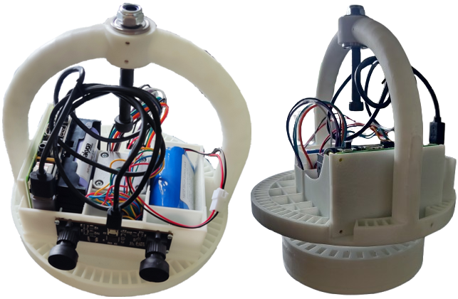

# Attitude control of satellite model using VR headset rotation

Project still under construction.

Used technologies:
- Rpi.GPIO (Python)
- pigpio (scripts in vm's machine code; also C python extension)
- aiortc (Python)
- WebRTC protocol
- WebXR

It is designed for Raspberry 3B+ with connected stepper motor and stereo camera. All of that is attached to 3d modeled custom box. A 3d printed flywheel is attached to stepper motor.  
Model hangs on external arm for simulating partial state of weghtlessness. Attitude control is achieved by reaction to flywheel rotation.

